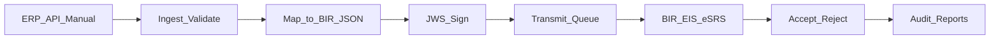

# BIR/EIS Middleware Portal

Multi-tenant SaaS middleware that maps ERP, manual, and API invoice data to BIR-compliant JSON, signs with JWS, and transmits and tracks submissions to the Bureau of Internal Revenue Electronic Invoicing System (EIS) / eSRS.

**Current version:** `0.1.0`  
**Status:** Greenfield scaffold / MVP in progress

## Why this exists

Under [Revenue Regulations No. 11-2025](https://bir-cdn.bir.gov.ph/BIR/pdf/RR%20No.%2011-2025.pdf), covered taxpayers must issue electronic invoices and report electronic sales under the CREATE MORE framework. The first-wave electronic invoicing compliance deadline was extended to **31 December 2026** via RR 26-2025 ([PwC summary](https://www.pwc.com/ph/en/tax/tax-publications/tax-alerts/2025/tax-alert-29.html)).

Official BIR portals:

- Production: [BIR EIS](https://eis.bir.gov.ph/#/main)
- Certification / testing: [BIR EIS Cert](https://eis-cert.bir.gov.ph/#/main)

This product helps taxpayers prepare structured invoices, sign them, and submit through those channels—it does **not** replace the taxpayer’s own EIS Certification or Permit to Transmit (PTT) obligations.

## Who is in scope

Per industry summaries of BIR phasing (Taxilla, ClearTax, PwC—not a substitute for official BIR lists):

| Wave | Typical coverage |
|------|------------------|
| **Wave 1 (first)** | Large Taxpayers Service (LTS) / large taxpayers, e-commerce sellers, and Computerized Accounting System (CAS) / CAS-related users as BIR designates |
| **Later** | Exporters, firms under incentives, and POS-heavy taxpayers when BIR systems and issuances are ready |

Confirm exact coverage and timelines with your RDO and current BIR issuances.

## Middleware architecture

Target flow (aspirational MVP—not yet shipped):



### Target layers

| Layer | Responsibility |
|-------|----------------|
| **Ingest** | API, manual entry, and SAP/ERP connectors |
| **Compliance engine** | Zod/schema validation, BIR JSON document build, JWS signing (RS256) |
| **Transmission** | EIS Cert (sandbox) vs production endpoints, retries, idempotency |
| **Portal** | Tenants, RBAC, credential vault for taxpayer certs/PTT metadata, submission inbox, reports |
| **Retention / audit** | Signed payloads plus BIR accept/reject responses |

### Technical expectations (product orientation)

- Structured **JSON** invoices (PDF or scans alone do not qualify)
- **JWS** digital signature on transmitted documents
- Document types commonly cited: Sales Invoice, Official Receipt, Service Billing, Debit/Credit Note (or Memo)
- Typical path: create → sign → send (API or eSRS) → confirmation; industry guidance often cites a **3-day** reporting window once ESRS is live
- Onboarding path: EIS Cert portal → software testing capabilities → taxpayer **Permit to Transmit (PTT)**
- Retention: industry guidance often cites **~10 years** digital retention (printed backups commonly discussed for early years)—treat as guidance and verify against official RR text

**Accuracy note:** EIS Certification and PTT are **taxpayer responsibilities**. This app is middleware that helps the taxpayer comply; it does not claim BIR accreditation of the vendor as an “EIS provider.”

## Target file structure

Planned layout under `src/` (not the current tree—today only a Next.js App Router scaffold exists):

```text
src/
├── app/
│   ├── (marketing)/     # Public landing
│   ├── (provider)/      # Provider console (tenants, clients, settings, reports)
│   ├── (auth)/          # Login, register
│   ├── (app)/           # Tenant app (dashboard, outbound, inbound, settings, reports)
│   └── api/v1/          # Public/internal API (ingest, submissions)
├── components/          # Shared UI (ShadCN, data-table)
├── config/              # Navigation, modules
├── content/             # releases.ts, guides
├── features/
│   └── eis/             # JSON build, JWS, transmit adapters, submission domain
├── lib/                 # auth, database, crypto, notifications, storage
└── proxy.ts             # Route protection
```

Route groups (planned): marketing `(marketing)`, tenant app `(app)`, provider `(provider)`, API under `app/api/v1/`.

## Stack

**Planned:** Next.js App Router · ShadCN · Tailwind · React Hook Form · Zod · Zustand · Better Auth · Prisma 7 · PostgreSQL · Pino · Resend · Local filesystem storage · React PDF

**Installed today:** Next.js 16, React 19, Tailwind CSS 4, TypeScript, ESLint.

## What’s shipped vs roadmap

### Shipped

| Item | Notes |
|------|--------|
| Next.js 16 App Router scaffold | Basic `src/app` layout and landing page |
| This README | Product brief + engineering entrypoint |
| Postgres notes | [`database/postgres.example.md`](database/postgres.example.md) |

### Roadmap (MVP)

| Item | Notes |
|------|--------|
| Auth & multi-tenancy | Better Auth, tenant-scoped sessions, RBAC |
| Invoice document model | Prisma + PostgreSQL |
| JSON + JWS pipeline | Validate, map, sign (RS256) |
| EIS transmit adapter | Cert/sandbox first, then production |
| Submission status UI | Outbound inbox, accept/reject visibility |
| Audit trail | Signed payloads + BIR responses |
| Release notes | `src/content/releases.ts` wired to package version |

## Setup

What works on this scaffold today:

1. Install: `pnpm install`
2. Dev server: `pnpm run dev`
3. Postgres: see [`database/postgres.example.md`](database/postgres.example.md) for connection and cutover notes when the database layer lands

Auth, Prisma migrate/seed scripts, and demo users are **not** available yet.

### Scripts (available now)

| Script | Description |
|--------|-------------|
| `pnpm run dev` | Development server |
| `pnpm run build` | Production build |
| `pnpm run start` | Start production server |
| `pnpm run lint` | ESLint |

## Official + reference links

| Resource | URL |
|----------|-----|
| BIR EIS (production) | https://eis.bir.gov.ph/#/main |
| BIR EIS Cert | https://eis-cert.bir.gov.ph/#/main |
| RR No. 11-2025 (PDF) | https://bir-cdn.bir.gov.ph/BIR/pdf/RR%20No.%2011-2025.pdf |
| PwC tax alert (RR 26-2025 / Dec 2026) | https://www.pwc.com/ph/en/tax/tax-publications/tax-alerts/2025/tax-alert-29.html |
| Taxilla EIS guide | https://www.taxilla.com/eninvoice-philippines-bir-eis-compliance-2026 |
| ClearTax PH e-invoicing overview | https://www.cleartax.com/lp/ph/e-invoicing-solution |

## Disclaimer

Regulatory summaries and industry primers above are for **product orientation only**, not legal or tax advice. Taxpayers should verify requirements against official BIR issuances and their RDO / CAS process. EIS Certification and Permit to Transmit remain the taxpayer’s responsibility.
