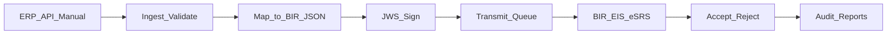
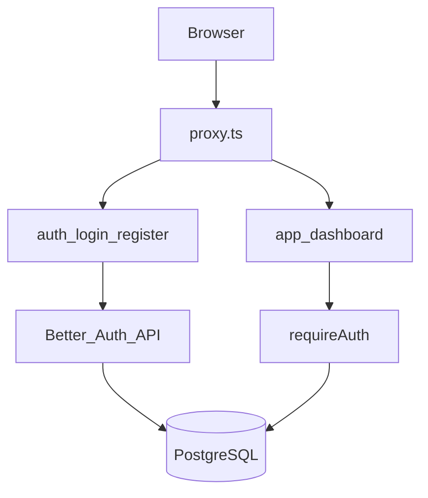

# BIR/EIS Middleware Portal

Multi-tenant SaaS middleware that maps ERP, manual, and API invoice data to BIR-compliant JSON, signs with JWS, and transmits and tracks submissions to the Bureau of Internal Revenue Electronic Invoicing System (EIS) / eSRS.

**Current version:** `0.3.3`  
**Status:** Foundation MVP + portal settings, account profile/password, EIS credential vault, and audit logs

## Why this exists

Under [Revenue Regulations No. 11-2025](https://bir-cdn.bir.gov.ph/BIR/pdf/RR%20No.%2011-2025.pdf), covered taxpayers must issue electronic invoices and report electronic sales under the CREATE MORE framework. The first-wave electronic invoicing compliance deadline was extended to **31 December 2026** via RR 26-2025 ([PwC summary](https://www.pwc.com/ph/en/tax/tax-publications/tax-alerts/2025/tax-alert-29.html)).

Official BIR portals:

- Production: [BIR EIS](https://eis.bir.gov.ph/#/main)
- Certification / testing: [BIR EIS Cert](https://eis-cert.bir.gov.ph/#/main)

This product helps taxpayers prepare structured invoices, sign them, and submit through those channels—it does **not** replace the taxpayer’s own EIS Certification or Permit to Transmit (PTT) obligations.

## Who is in scope

Per industry summaries of BIR phasing (Taxilla, ClearTax, PwC—not a substitute for official BIR lists):

| Wave | Typical coverage |
|------|------------------|
| **Wave 1 (first)** | Large Taxpayers Service (LTS) / large taxpayers, e-commerce sellers, and Computerized Accounting System (CAS) / CAS-related users as BIR designates |
| **Later** | Exporters, firms under incentives, and POS-heavy taxpayers when BIR systems and issuances are ready |

Confirm exact coverage and timelines with your RDO and current BIR issuances.

## Middleware architecture

Target flow (EIS engine still on the roadmap):



Foundation flow (shipped in `0.2.0`):



### Target layers

| Layer | Responsibility |
|-------|----------------|
| **Ingest** | API, manual entry, and SAP/ERP connectors |
| **Compliance engine** | Zod/schema validation, BIR JSON document build, JWS signing (RS256) |
| **Transmission** | EIS Cert (sandbox) vs production endpoints, retries, idempotency |
| **Portal** | Tenants, RBAC, credential vault for taxpayer certs/PTT metadata, submission inbox, reports |
| **Retention / audit** | Signed payloads plus BIR accept/reject responses |

### Technical expectations (product orientation)

- Structured **JSON** invoices (PDF or scans alone do not qualify)
- **JWS** digital signature on transmitted documents
- Document types commonly cited: Sales Invoice, Official Receipt, Service Billing, Debit/Credit Note (or Memo)
- Typical path: create → sign → send (API or eSRS) → confirmation; industry guidance often cites a **3-day** reporting window once ESRS is live
- Onboarding path: EIS Cert portal → software testing capabilities → taxpayer **Permit to Transmit (PTT)**
- Retention: industry guidance often cites **~10 years** digital retention (printed backups commonly discussed for early years)—treat as guidance and verify against official RR text

**Accuracy note:** EIS Certification and PTT are **taxpayer responsibilities**. This app is middleware that helps the taxpayer comply; it does not claim BIR accreditation of the vendor as an “EIS provider.”

## File structure

```text
src/
├── app/
│   ├── (marketing)/     # Public landing
│   ├── (auth)/          # Login, register
│   ├── (app)/           # Tenant app (dashboard, settings, audit-log, users, stubs)
│   └── api/auth/        # Better Auth handler
├── components/ui/       # ShadCN primitives
├── config/              # Navigation
├── content/             # releases.ts
├── features/
│   ├── auth/            # Register action + schemas
│   └── settings/        # Org + EIS credential forms/actions
├── lib/                 # auth, audit, crypto, database, shared version helpers
└── proxy.ts             # Deny-by-default route protection
```

Provider console `(provider)/` and EIS `features/eis/` land in later slices.

## Stack

**Installed:** Next.js 16 · React 19 · Tailwind CSS 4 · TypeScript · ESLint · ShadCN (new-york/zinc) · Better Auth · Prisma 7 · PostgreSQL · Zod · bcryptjs

**Planned later:** React Hook Form · Zustand · Pino · Resend · React PDF · EIS JSON/JWS transmit adapters

## What’s shipped vs roadmap

### Shipped (`0.2.0`–`0.3.1`)

| Item | Notes |
|------|--------|
| Multi-tenant auth | Better Auth email/password, tenant-scoped users, register organization |
| RBAC foundation | Roles + permissions (`dashboard.view`, `settings.view` / `settings.manage`, `users.manage`, `audit.view`) |
| Prisma 7 + Postgres | Tenant/User/Role/Permission + EisCredential + AuditLog + Better Auth tables |
| App shell | Marketing landing, login/register, authenticated dashboard + shadcn sidebar-07 shell |
| Dashboard overview | Analytics-style home with KPIs, status mix, top customers, system status (`0.2.2`) |
| Organization settings | Name, tagline, logo (`0.3.0`); two-pane Settings menu (`0.3.1`) |
| EIS credential vault | TIN, Cert/Prod, PTT metadata, encrypted API key with last-4 mask (`0.3.0`) |
| Audit logs | Tenant-scoped activity list for settings/credential changes (`0.3.0`) |
| Users list | Sidebar entry + read-only team table (invite/role edit later) |
| Releases | `src/content/releases.ts` aligned with `package.json` |
| Docs / env | README, `.env.example` (includes `CREDENTIALS_ENCRYPTION_KEY`), Postgres notes |

### Roadmap (next slices)

| Item | Notes |
|------|--------|
| Invoice document model | Prisma + PostgreSQL |
| JSON + JWS pipeline | Validate, map, sign (RS256) |
| EIS transmit adapter | Cert/sandbox first, then production |
| Submission status UI | Outbound inbox, accept/reject visibility |
| Invite users / role matrix | Admin UX for membership and permissions |
| Provider console | Cross-tenant operator views |

## Setup

1. Install: `pnpm install`
2. Copy env: `cp .env.example .env.local` and set secrets + Postgres URLs (include `CREDENTIALS_ENCRYPTION_KEY` for the credential vault)
3. Generate client: `pnpm run db:generate`
4. Migrate + seed (when Postgres is reachable):
   ```bash
   pnpm run db:migrate
   pnpm run db:seed
   ```
5. Dev server: `pnpm run dev`

Demo logins after seed: see [`database/seed-users.md`](database/seed-users.md) (password `DemoPass123`).

Postgres notes: [`database/postgres.example.md`](database/postgres.example.md). The agent does not start Docker Compose for you.

### Scripts

| Script | Description |
|--------|-------------|
| `pnpm run dev` | Development server |
| `pnpm run lint` | ESLint |
| `pnpm run typecheck` | TypeScript (`tsc --noEmit`) |
| `pnpm run db:generate` | Prisma Client generate |
| `pnpm run db:migrate` | Create/apply migrations (local) |
| `pnpm run db:deploy` | Apply migrations (CI/prod) |
| `pnpm run db:seed` | Seed demo tenant, roles, users |
| `pnpm run db:studio` | Prisma Studio |
| `pnpm run build` | Production build |
| `pnpm run start` | Start production server |

## Official + reference links

| Resource | URL |
|----------|-----|
| BIR EIS (production) | https://eis.bir.gov.ph/#/main |
| BIR EIS Cert | https://eis-cert.bir.gov.ph/#/main |
| RR No. 11-2025 (PDF) | https://bir-cdn.bir.gov.ph/BIR/pdf/RR%20No.%2011-2025.pdf |
| PwC tax alert (RR 26-2025 / Dec 2026) | https://www.pwc.com/ph/en/tax/tax-publications/tax-alerts/2025/tax-alert-29.html |
| Taxilla EIS guide | https://www.taxilla.com/eninvoice-philippines-bir-eis-compliance-2026 |
| ClearTax PH e-invoicing overview | https://www.cleartax.com/lp/ph/e-invoicing-solution |

## Disclaimer

Regulatory summaries and industry primers above are for **product orientation only**, not legal or tax advice. Taxpayers should verify requirements against official BIR issuances and their RDO / CAS process. EIS Certification and Permit to Transmit remain the taxpayer’s responsibility.
